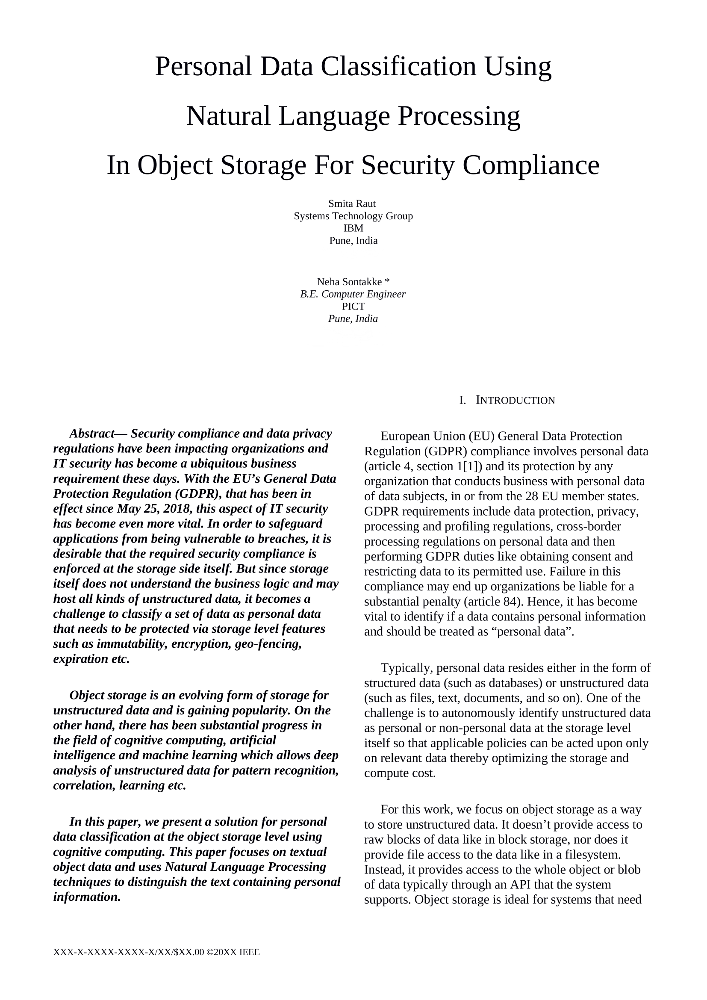

# Personal-Data-Classification-Using-NLP-In-Object-Storage-For-Security-Compliance
A solution for personal data classification at the object storage level using cognitive computing. An asynchronously running middleware was added to openstacks' swift object storage service. Using Regex, Scikit Learn and Spacy a helper for named entity recognition was created. The module ran successfully, without obstructing any other process. After multiple tests the time required for object put with middleware differed from normal only by less than two or three seconds.

The POC Video can be found on: https://youtu.be/l2ntsr1izPs

An unpublished whitepaper, presented at IEEE Cloud Computing in Emerging Markets 2018. 
 
Technologies used : Openstack Swift for object storage, Python for NLP (Scikit Learn, Keras, Spacy).
 
For further details please feel free to contact my gmail account at nsontakke004.
