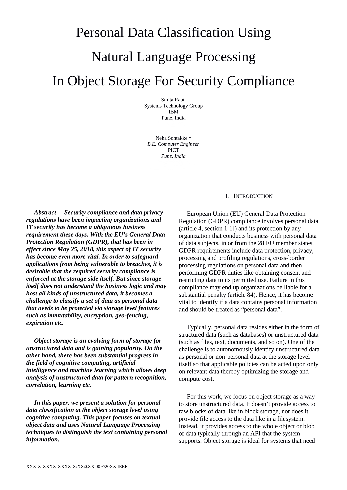

# Personal-Data-Classification-Using-NLP-In-Object-Storage-For-Security-Compliance
A solution for personal data classification at the object storage level using cognitive computing. 

An unpublished whitepaper, presented at IEEE Cloud Computing in Emerging Markets 2018. 
 
Technologies used : Openstack Swift for object storage, Python for NLP (Scikit Learn, Keras, Spacy).
